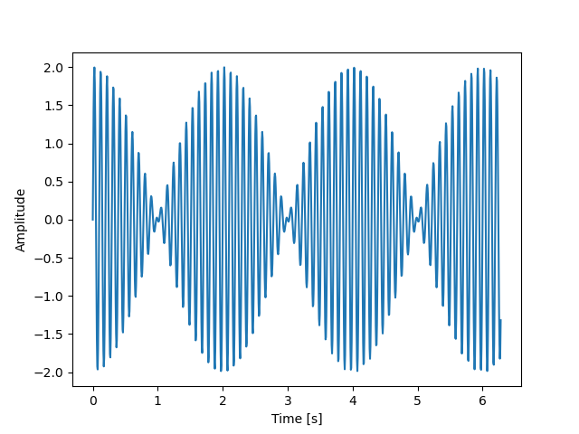

# Conversations with Google Bard

Google Bard is a ChatGPT-like LLM with a similar web interface
and capabilities.  As opposed to ChatGPT, it can show graphs.

## Conversations

1. [Can you explain about the Lennard-Jones potential?](https://g.co/bard/share/d9fda29c1e3c):
   Bard got the derivation of the force right on the first try (as opposed to GPT-3.5).
1. [Can you identify the signal represented in this plot?](https://g.co/bard/share/3eef02b46153):
   an attempt to analyze a signal generated by `create_signal.py` using Bard.  The plot uploaded
   to Bard is `signal.png`.
   
